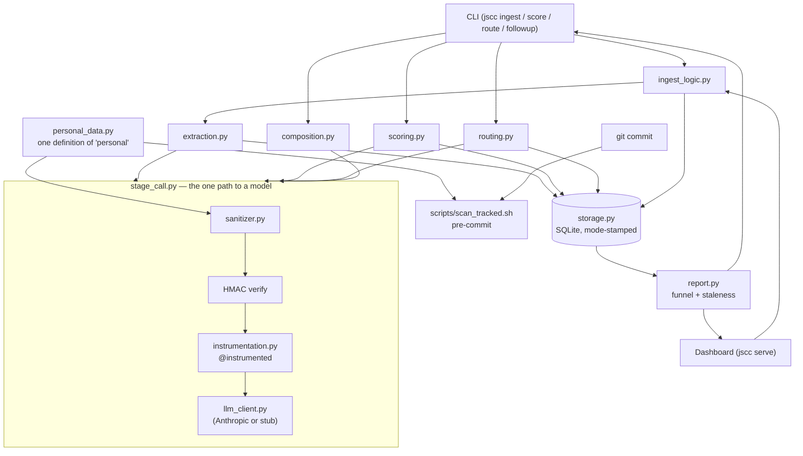

# Technical reference

Architecture, repo layout, development commands, and the full phase-by-phase status — the detail a peer engineer or reviewer would want after the [README](../README.md)'s pitch, not before it. Eval figures and round history live in [evals/README.md](../evals/README.md), not here; this doc doesn't repeat them.

## Architecture

Every LLM stage — extraction, scoring, routing, composition — reaches the model through one path: `stage_call.py`. That's deliberate ([D7](design-principles.md#d7--dual-use-data-safety-structural-not-disciplinary)) — no caller can skip the sanitizer, and no caller can duck the cost meter.



Two egress points, one shared definition of "personal": the sanitizer guards every call to a model, and the pre-commit scanner guards every commit, both reading `personal_data.py` rather than keeping their own rules. The mode-stamped storage layer (synthetic vs. real) is the third structural guard — [ADR-003](../decisions/003-mode-isolation.md).

## Running the dashboard in production

The dashboard (`jscc/web/`, ADR-007) is the same read/write logic as the CLI, rendered over HTTP. Same mode rules as everything else: the `JSCC_DATA` env var picks synthetic vs. real, and the SYNTHETIC MODE banner in the page header tells you which one you're looking at. See the README's [Quick start](../README.md#quick-start) for the demo command; this is the production path.

```bash
JSCC_DATA=real uv run jscc db init      # first run only
JSCC_DATA=real uv run jscc serve --host 127.0.0.1 --port 8000
```

`serve` binds to `127.0.0.1` by default, not `0.0.0.0` — it's a personal tool over real job-search data, not a service meant to be reachable from other hosts. There's no auth layer, so don't widen the bind address on a shared or exposed machine. The server also refuses any request whose `Host` header is not a loopback name or the address you bound (a DNS-rebinding guard) and any cross-origin POST; see threat T13 in [threat-model.md](threat-model.md). `--data-dir` and `--config-dir` are also available if you're pointing at a non-default location (see `uv run jscc serve --help`).

Submitting the DLQ resolve form (`/dlq/{id}/resolve`) runs an extraction call: with no `ANTHROPIC_API_KEY` it uses a placeholder extractor in synthetic mode (fine for a demo) and refuses in real mode rather than save a made-up application. If the extracted title or company doesn't verify against the pasted text, the form is a two-step confirm instead of a one-step create: the page re-renders a review screen instead of creating anything, and only that screen's own resubmit does. The extraction a resubmit replays is looked up server-side by DLQ entry id, never trusted from the request itself -- see `jscc/dlq.py`'s `use_pending_extraction`.

## Repo layout

```
jscc/           library code
  config.py     load + validate stages.yaml, profile.yaml
  mode.py       synthetic/real mode resolution + DB path convention
  storage.py    SQLite persistence with stamped mode marker
  models.py     pydantic domain models (Application, Contact, Interaction, ...)
  seed.py       deterministic synthetic fixture (evaluation infrastructure)
  sanitizer.py  the LLM-egress choke point; redacts, then HMAC-wraps
  personal_data.py  one definition of "personal" — shared by the scanner + sanitizer
  json_utils.py one definition of the JSON serialization fallback — shared by storage + sanitizer
  paths.py      one definition of where this installation's files live (package-anchored, never cwd)
  instrumentation.py  @instrumented — cost/latency/token capture on every LLM call
  extraction.py the extract_jd interface (D9 step 1) + JD extraction prompt
  llm_client.py Anthropic client + one stub client per stage (no key is configured)
  evals.py      hand-rolled eval harness (jd_extraction, fit_scoring, routing, composition)
  fetcher.py    guarded requests + readability JD fetcher; optional Playwright fallback for JS-heavy pages
  scoring.py    the score_fit interface (D9 step 2) + fit-scoring prompt
  routing.py    the route_followup interface (D10 step 1) + routing prompt
  composition.py  compose_followup, the composition prompt (D10 step 2A)
  followup.py   briefing renderer (D10 step 2B) + the top-level followup() orchestrator
  report.py     staleness detector + funnel counts + pipeline grouping (group_by_stage)
  ingest_logic.py  shared extract-then-store path (extract_and_create_application) for ingest and DLQ resolution
  dlq.py        DLQ resolution (resolve_dlq_entry_via_paste), shared by resolve-dlq and the dashboard's resolve form
  stage_call.py the one path from an LLM stage to the model client: sanitize, verify, meter, call
  terminal.py   strips control characters from everything a command prints
  cli/          click entry point, one module per command family: admin (validate-config, db init, seed, report, costs),
                ingest (ingest, dlq list, resolve-dlq), agents (score, route, followup), eval_cmds (eval <suite>), web (serve)
  web/          FastAPI + Jinja2 dashboard app (ADR-007); templates/ holds the Jinja2 pages
tests/          pytest suite (787 tests)
config/         stages.yaml, profile.example.yaml, pipeline.yaml (playwright_fallback flag)
evals/          eval suites (jd_extraction, fit_scoring, routing, composition); evals/README.md
scripts/        pre-commit content scanner (imports its rules from jscc/personal_data.py); smoke_fetch.py (real-URL smoke test, not CI-gated); active_time.py (active-time proxy from commit gaps, prints its own bias); capture_tools.py (manual-capture and proxy tooling for the eval suites)
decisions/      ADRs (see below)
docs/           design-principles.md; threat-model.md; gate-reviews.md; lessons-learned.md; how-i-built-this.md; technical-reference.md (this file)
.github/        CI workflow
data/           synthetic.db, real.db -- both gitignored; seed regenerates the synthetic one
```

## ADRs

Design decisions with rejected alternatives:

- [ADR-001 — pydantic vs. jsonschema](../decisions/001-pydantic-vs-jsonschema.md)
- [ADR-002 — stdlib sqlite3](../decisions/002-stdlib-sqlite3.md)
- [ADR-003 — mode isolation via stamped marker](../decisions/003-mode-isolation.md)
- [ADR-004 — pre-commit.com framework + local Python hook](../decisions/004-precommit-framework.md)
- [ADR-005 — sanitizer authenticity via HMAC wrapper](../decisions/005-sanitizer-authenticity.md)
- [ADR-006 — eval bars, manual capture, and deterministic grading](../decisions/006-eval-bars-and-manual-capture.md)
- [ADR-007 — dashboard web stack: FastAPI + Jinja2](../decisions/007-web-stack-choice.md)

The ten locked design principles behind them are in [design-principles.md](design-principles.md).

## Development

```bash
uv sync
uv run pytest              # ~seconds
uv run ruff check .        # lint
uv run ruff format --check .  # formatting
uv run python -m jscc eval jd_extraction --replay   # eval suite, no API key
uv run pre-commit install  # enable the safety scanner + ruff hooks
uv run playwright install chromium  # optional -- only needed to use the Playwright fetch fallback
```

The pre-commit scanner refuses commits that match email/phone patterns, an Anthropic API key, or entries in `.safety/danger-list.txt` and the gitignored `.safety/danger-list.local.txt`. It reads the same two lists, from the same package-anchored location, as the LLM sanitizer — that shared location is part of the guarantee, not an implementation detail.

Lint and format are ruff (`pyproject.toml`'s `[tool.ruff]`), enforced by the same pre-commit hooks and CI job as the content scanner. `E501` (line length) is deliberately off — this codebase's design-rationale comments and docstrings are long-form prose by design, and wrapping them at a fixed column would be churn against an established writing style, not a real improvement.

## Status

**Read [CHANGELOG.md](../CHANGELOG.md) for the arc.** This section is the current state only. The README's [Status](../README.md#status) section has the one-line summary; this table has the phase-by-phase detail.

| | Shipped | Next |
|---|---|---|
| **Phase A — foundations** | Config, storage with a stamped mode marker, the sanitizer choke point, the pre-commit scanner, 5 ADRs. Closed after three gate rounds. | — |
| **Phase B — ingestion + extraction** | Extraction eval suite and prompt, fetcher with a Playwright fallback and a dead-letter queue, a paste-only path, a three-value exit contract, a ruff lint/format gate. Gate closed. | — |
| **Phase C — fit scoring** | Fit-scoring eval suite, prompt and call path, `--manual` capture, and `jscc costs` (per-feature cost and latency, and a check that flags a recorded cost that no longer matches its model's published rate). Gate closed. | — |
| **Phase D — follow-up drafter** | Routing (suite, prompt, `route`), composition (suite, prompt, a deterministic grader, a `needs_input` escape so the composer can decline instead of inventing a fact), the briefing renderer and `followup`. Gate closed 2026-09-20. | — |
| **Phase E — dashboard** | `jscc serve`: funnel, pipeline and stale-alert views built on the same `report.py` functions `jscc report` uses (so the two cannot disagree on what is stale), application detail, a DLQ list, and a DLQ resolve form that calls the same function as `resolve-dlq`, the one write path. Gate closed 2026-09-24: adversarial highs fixed (dashboard request guards, a duplicate-resolve race, an internationalized-hostname gap in the DNS pin) and the walkthrough lens's doc and test fixes landed. | — |
| **Phase F — narrative** | **Closed 2026-09-27** — the last phase in the original plan, so this is functionally v1. F1 (the README), F2 prep ([docs/video-script.md](video-script.md) + redacted demo fixtures), F3a (a blog outline, kept as a private planning doc rather than a repo file), and F4 ([lessons-learned.md](lessons-learned.md)) all shipped. A same-day full-project gate (first whole-repo pass, not phase-scoped) found and fixed one High: a prefix-collision bug that silently defeated contact-name redaction. | F2's actual recording and F3b's blog revision/publish are open, deliberately decoupled from phase bookkeeping — standing personal-cadence items, not unfinished Phase F work. |

**Eval status.** Current numbers, every round that produced them, and the threats to validity are in [evals/README.md](../evals/README.md); none of them is a held-out rate. Headline figures only, for orientation:
- **Extraction: 33/38 (87%)**, one round on the current prompt, tuned against 36 of those cases. Includes 2 T5 coverage-expansion cases (held-out from tuning) captured 2026-09-28: one passed, one failed on format — see [threat-model.md](threat-model.md) T5.
- **Fit scoring: 29/30 (97%)**, on a revised prompt, after two earlier rounds (84%, then 64%) exposed rubric gaps. Includes 2 T5 coverage-expansion cases, both passed.
- **Routing: 38/39 (97%)**, round 6b plus a T5 coverage-expansion capture: core 25/26 (tuned on), held-out 10/10 (n=10, not tuned on), hostile 2/2, hostile_held_out 1/1. The router model alone scores 37/39, with one false-routine a code check overturns.
- **Composition: 25/28 (89%)** on the prompt fixed for invented dates, above the 75% bar; the grader is deterministic and does not judge tone, so a pass means no mechanical defect, not a good email.
- No `ANTHROPIC_API_KEY` is configured, so every prompt was checked with completions captured by hand in Claude.ai chat and replayed through the harness. CI replays the recordings and pins the published numbers, which catches a grader or prompt change but cannot judge new input.

**Gates.** Each phase closed with two cold reviews: one adversarial, one reading the repo as an outside reviewer would. They have produced the changes worth knowing about: a DNS-rebinding path in the fetcher that an earlier review had rated low-risk, contact-name redaction that the docs described and no caller performed, a schema bump that stamped older databases without migrating them, and at the Phase E gate a duplicate-resolve race and an internationalized-hostname gap in the DNS pin, both of which contradicted earlier "fixed" entries. How the gates run, with worked findings: [gate-reviews.md](gate-reviews.md).

**Cost envelope.** No real dollar figures exist yet: every model call so far ran against a stub client or was captured by hand through Claude.ai chat, never a billed `AnthropicClient` request, since this project is not using the Anthropic Console. What does exist: every call path is instrumented (D5), the ledger and `jscc costs` are built and tested against synthetic call records, and a call that fails mid-request leaves a marked row instead of vanishing. The honest claim today is "the cost-transparency machinery is built and correct", not "here is what this costs to run"; that waits on a live key.

787 pytest cases. Lint and format enforced via ruff (see Development, above).
